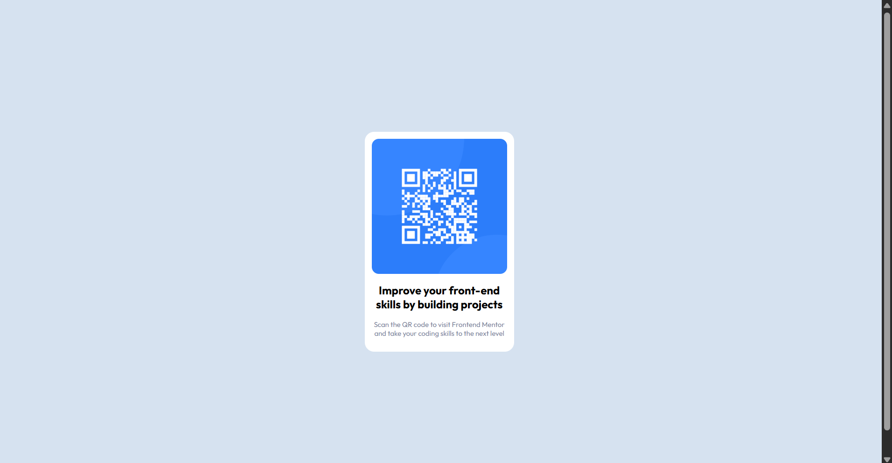

# Frontend Mentor - QR code component solution

This is a solution to the [QR code component challenge on Frontend Mentor](https://www.frontendmentor.io/challenges/qr-code-component-iux_sIO_H). Frontend Mentor challenges help you improve your coding skills by building realistic projects. 

## Table of contents

- [Overview](#overview)
  - [Screenshot](#screenshot)
  - [Links](#links)
- [My process](#my-process)
  - [Built with](#built-with)
  - [What I learned](#what-i-learned)
  - [Continued development](#continued-development)
  - [AI Collaboration](#ai-collaboration)
- [Author](#author)
- [Acknowledgments](#acknowledgments)

## Overview
This project was a newbie challenge on forntend mentor, a basic website to brush up the concepts and revise them for the ones who had started it before or as a practice problm for one who is new to it. 

### Screenshot

### Links

- Solution URL: [url](https://github.com/anushka146/qrcode_project)
- Live Site URL: [live site](https://anushka146.github.io/qrcode_project)

## My process
I first made a basic structure with html then used css for styling it using flexbox and then i modified it for responsive output. 

### Built with

- Semantic HTML5 markup
- CSS custom properties
- Flexbox
### What I learned
I got to brush up my concepts of html and css which i learnt before from Angela Yu's course.

### Continued development
I realised my weak point that is making a website responsive, i will improve my weak point which i realised and continue revising javascript afterwards.

### AI Collaboration

I used AI tools when i got stuck in responsive design, it helped me revise min-height, max-width and other concepts.

## Author
- Frontend Mentor - [Anushka146](https://www.frontendmentor.io/profile/anushka146)

## Acknowledgments
Thankful to frontend mentor for giving me a platform to revise and practice interactively.